# Werewolf RAG Multi-Agent Prediction System

This repository contains a local-first Werewolf role prediction pipeline for the NTU AI HW2 task.  It combines transcript parsing, retrieval-augmented rule context, staged reasoning, deterministic role constraints, and audited submission packaging.

The public `main` branch is organized for review, reproduction, and hand-off.  It includes the packaged HW2 submission folder, a detailed experiment archive, validated upload candidates, and bilingual technical documentation.

## Current status

| Item | Value |
| --- | --- |
| Current branch | `main` |
| Current upload candidate | `v1842e` (`black_boost_queue#5`) |
| Current upload file | `experiments/final_submission_package/current_upload/submission.csv` |
| Current upload SHA-256 | `6223a0ead5230c655d0ea09ccd3c6a5af51f8d35af2f2b9dd118b584cf8d6d7f` |
| Best verified private score before extra sprint | `v1840c = 0.49349` |
| Extra-submit batch | `experiments/final_submission_package/upload_batch_2026-05-15_extra3/` |
| Required submission shape | `397` rows, columns `id,index,character,role,wolf_score` |

## Quick start

Validate the current upload candidate:

```bash
python3 werewolf-project/assert/validate_submission.py \
  experiments/final_submission_package/current_upload/submission.csv
```

Expected output:

```text
OK: 397 predictions validated
```

Rebuild the packaged HW2 submission from the bundled checkpoint:

```bash
cd hw2_D13922024
python3 make_final.py --output /tmp/werewolf_submission_check.csv
```

Inspect the current upload readiness report:

```bash
python3 experiments/scripts/v1888_final_upload_preflight.py
python3 experiments/scripts/v1908_final_goal_status.py
```

## Main documentation

| Document | Purpose |
| --- | --- |
| [`README.zh-TW.md`](README.zh-TW.md) | Traditional Chinese public overview |
| [`docs/TECHNICAL_REPORT.md`](docs/TECHNICAL_REPORT.md) | Detailed English technical report with diagrams and tables |
| [`docs/TECHNICAL_REPORT.zh-TW.md`](docs/TECHNICAL_REPORT.zh-TW.md) | Detailed Traditional Chinese technical report |
| [`docs/PROJECT_STRUCTURE.md`](docs/PROJECT_STRUCTURE.md) | Repository map and artifact guide |
| [`docs/REPRODUCIBILITY.md`](docs/REPRODUCIBILITY.md) | Reproduction, validation, and score-recording guide |
| [`hw2_D13922024/hw2_report.md`](hw2_D13922024/hw2_report.md) | Coursework report package |
| [`hw2_D13922024/hw2_report.zh-TW.md`](hw2_D13922024/hw2_report.zh-TW.md) | Traditional Chinese coursework report |

## Architecture snapshot

```mermaid
flowchart LR
    A[Raw game transcripts] --> B[Stage 1: transcript fetching]
    B --> C[Structured events: claims, votes, deaths, statements]
    C --> D[RAG rule context]
    D --> E[Stage 2: player analysis and wolf scores]
    E --> F[Stage 3: role-budget solver]
    F --> G[Deterministic audits and calibration overlays]
    G --> H[Validated submission CSV]
    H --> I[Manifest, score ledger, preflight reports]
```



## Repository highlights

```text
hw2_D13922024/                                  Packaged HW2 project and reports
experiments/final_submission_package/           Validated candidate archive and current upload state
experiments/final_submission_package/manifests/ Candidate manifest and score-feedback records
experiments/final_submission_package/reports/   Audit, routing, and reproducibility reports
experiments/final_submission_package/upload_batch_2026-05-15_extra3/
                                                Three fixed validated upload candidates
experiments/scripts/                            Submission packaging, routing, and guard scripts
werewolf-project/assert/validate_submission.py  CSV validator used by preflight checks
```

## Extra three-submit batch

The current fixed batch is ready for manual upload attempts:

| Order | Candidate | Path | SHA-256 |
| ---: | --- | --- | --- |
| 1 | `v1842e` | `experiments/final_submission_package/upload_batch_2026-05-15_extra3/01_v1842e_conservative_blackboost_isolation_private.csv` | `6223a0ead5230c655d0ea09ccd3c6a5af51f8d35af2f2b9dd118b584cf8d6d7f` |
| 2 | `v1845c` | `experiments/final_submission_package/upload_batch_2026-05-15_extra3/02_v1845c_high_variance_knownbest_blackboost_private.csv` | `dc42d87aceb2cd79d4e2f1ae026f03f234f6b4e4060aed784098df2f5f5ea401` |
| 3 | `v1826b` | `experiments/final_submission_package/upload_batch_2026-05-15_extra3/03_v1826b_structural_positive_followup_private.csv` | `8c16775f7eba65456c6050260ed8a0446ef11d2f75a4bdc2a39423400a2aad4b` |

Batch validation report:

```text
experiments/final_submission_package/upload_batch_2026-05-15_extra3/validation.md
```

## Method summary

1. Parse transcripts into player statements, claims, votes, executions, night deaths, and reveal windows.
2. Retrieve compact Werewolf rule/context snippets for role-specific interpretation.
3. Score each player with evidence features and local reasoning outputs.
4. Enforce game-size role budgets through a constrained solver.
5. Apply late deterministic audits for high-precision reveal and contradiction cases.
6. Package candidate CSVs with SHA-256 manifests, validation logs, and score-feedback routing.

## Known limits

- The current `v1842e` upload candidate is locally validated but not yet backed by a returned private score.
- The best recorded private score before the extra sprint is `0.49349` from `v1840c`.
- Full transcript-level reproduction may require local model availability through Ollama; the fast path copies bundled checkpoints and validates the CSV shape.
