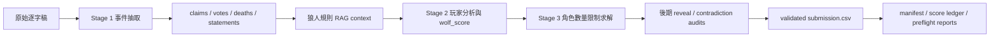

# Werewolf RAG Multi-Agent Prediction System（繁體中文）

本專案是 NTU AI HW2 的狼人角色預測系統，採用 local-first 設計：從遊戲逐字稿抽取事件，搭配規則檢索、分階段推理、角色數量限制求解、後期稽核與提交封裝，產生符合 Kaggle 格式的 `submission.csv`。

`main` branch 已整理成對外可閱讀的專案入口，包含可重現指令、詳細技術報告、提交候選、驗證報告與中英文文件。

## 目前狀態

| 項目 | 值 |
| --- | --- |
| 目前 branch | `main` |
| 目前 upload candidate | `v1842e` (`black_boost_queue#5`) |
| 目前 upload 檔案 | `experiments/final_submission_package/current_upload/submission.csv` |
| SHA-256 | `6223a0ead5230c655d0ea09ccd3c6a5af51f8d35af2f2b9dd118b584cf8d6d7f` |
| extra sprint 前最佳已驗證 private score | `v1840c = 0.49349` |
| 三連發候選資料夾 | `experiments/final_submission_package/upload_batch_2026-05-15_extra3/` |

## 快速驗證

```bash
python3 werewolf-project/assert/validate_submission.py \
  experiments/final_submission_package/current_upload/submission.csv
```

預期輸出：

```text
OK: 397 predictions validated
```

從封裝 checkpoint 重新產生一份 submission：

```bash
cd hw2_D13922024
python3 make_final.py --output /tmp/werewolf_submission_check.csv
```

## 主要文件

| 文件 | 說明 |
| --- | --- |
| [`docs/TECHNICAL_REPORT.zh-TW.md`](docs/TECHNICAL_REPORT.zh-TW.md) | 詳細繁體中文技術報告，含圖表與流程圖 |
| [`docs/TECHNICAL_REPORT.md`](docs/TECHNICAL_REPORT.md) | 英文技術報告 |
| [`docs/PROJECT_STRUCTURE.md`](docs/PROJECT_STRUCTURE.md) | 專案結構與 artifact 導覽 |
| [`docs/REPRODUCIBILITY.md`](docs/REPRODUCIBILITY.md) | 重現、驗證與回填分數流程 |
| [`hw2_D13922024/hw2_report.zh-TW.md`](hw2_D13922024/hw2_report.zh-TW.md) | 作業報告繁體中文版 |

## 架構總覽



## 三連發 upload path

| 順序 | Candidate | Path |
| ---: | --- | --- |
| 1 | `v1842e` | `experiments/final_submission_package/upload_batch_2026-05-15_extra3/01_v1842e_conservative_blackboost_isolation_private.csv` |
| 2 | `v1845c` | `experiments/final_submission_package/upload_batch_2026-05-15_extra3/02_v1845c_high_variance_knownbest_blackboost_private.csv` |
| 3 | `v1826b` | `experiments/final_submission_package/upload_batch_2026-05-15_extra3/03_v1826b_structural_positive_followup_private.csv` |

三個檔案都已通過 `OK: 397 predictions validated`。

## 已知限制

- `v1842e` 目前是本地驗證完成的 upload candidate，但尚未有回傳 private score。
- extra sprint 前最佳已知 private score 是 `v1840c = 0.49349`。
- 完整逐字稿層級重現需要本機 Ollama 模型；快速重現路徑會複製已封裝 checkpoint 並驗證 CSV 格式。
