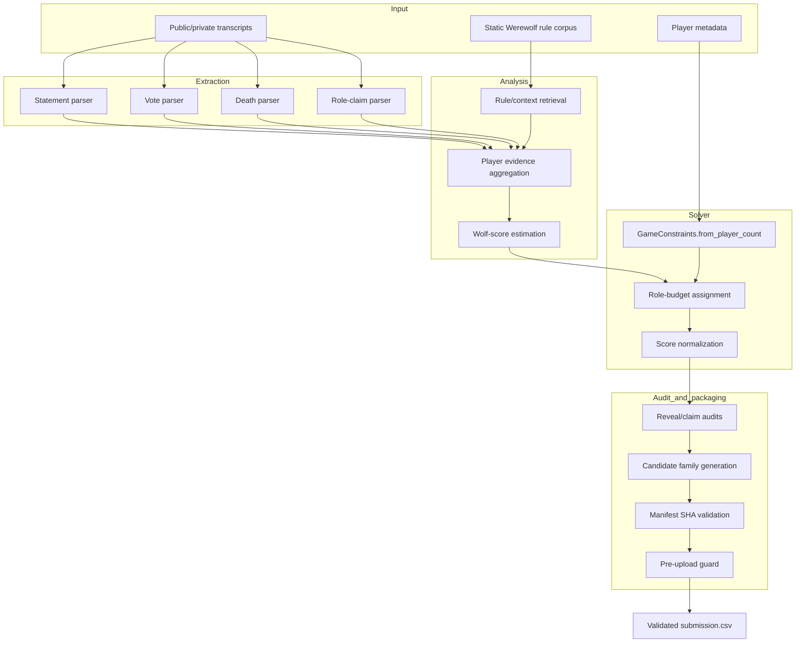
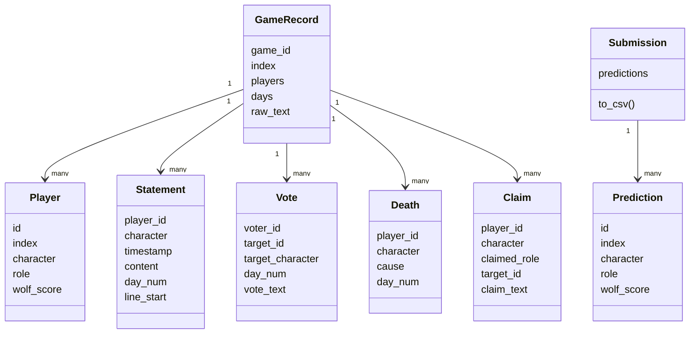
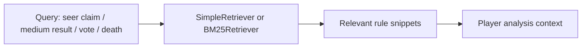
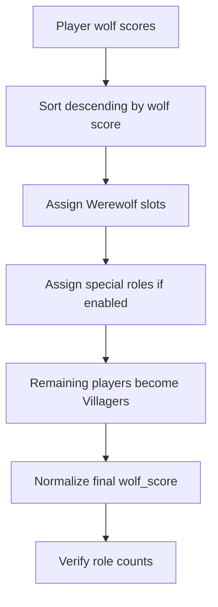
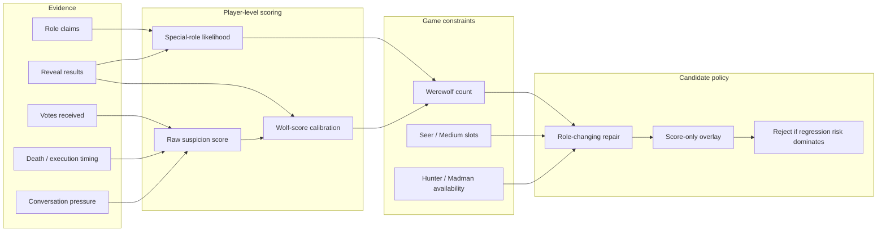
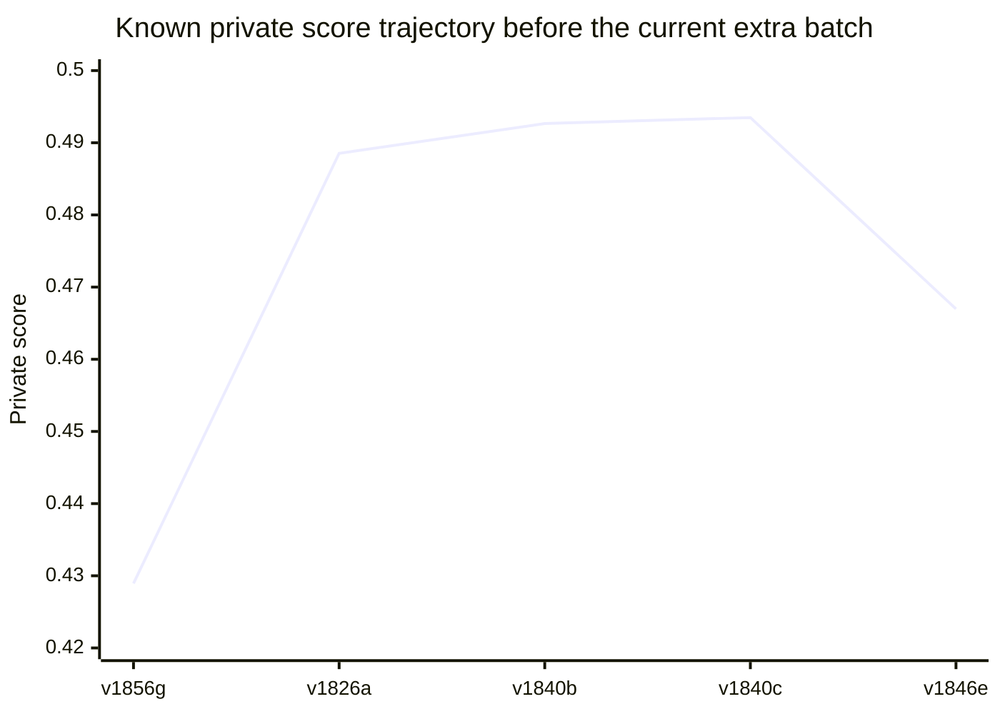
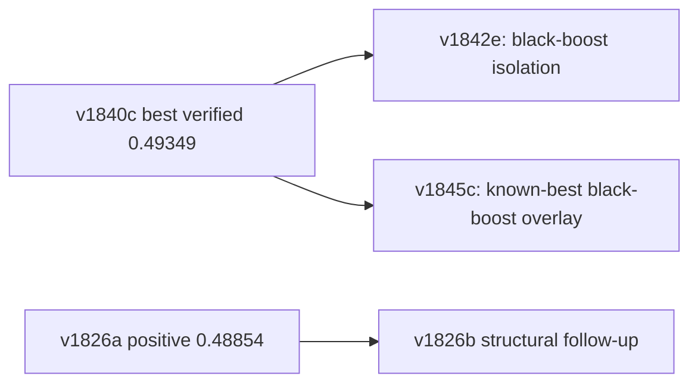
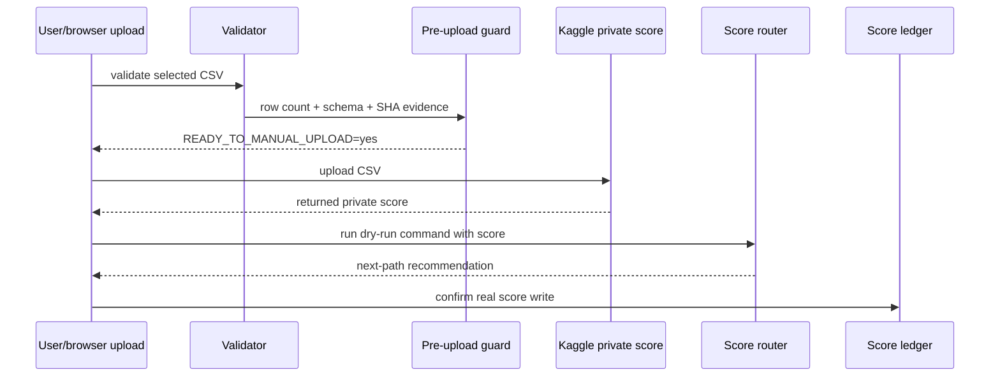

# Technical Report — Werewolf RAG Multi-Agent Prediction System

Date: 2026-05-15
Public branch: `main`
Current upload candidate: `v1842e`
Best verified private score before extra sprint: `v1840c = 0.49349`

## 1. Executive summary

This project predicts hidden Werewolf roles from long-form game transcripts.  The system is organized as a local-first, retrieval-augmented, multi-stage pipeline:

1. parse raw transcripts into structured events;
2. retrieve compact role/rule context;
3. estimate player-level suspicion and role evidence;
4. enforce game-size role constraints;
5. apply deterministic late-stage audits for high-precision reveal patterns;
6. package candidate CSVs with manifests, score ledgers, and pre-upload guards.

The repository now has two layers:

| Layer | Purpose | Primary path |
| --- | --- | --- |
| Packaged coursework project | Clean HW2 deliverable with report, code, checkpoint, and validator | `hw2_D13922024/` |
| Experiment/operations archive | Candidate families, score-feedback routing, preflight reports, upload batch | `experiments/final_submission_package/` |

## 2. Problem framing

The task requires one row per player with:

```text
id,index,character,role,wolf_score
```

Where:

| Field | Meaning | Constraint |
| --- | --- | --- |
| `id` | unique player row id | integer |
| `index` | game id | string such as `01` |
| `character` | player display name | exact dataset spelling |
| `role` | predicted hidden role | one of `Villager`, `Werewolf`, `Seer`, `Medium`, `Madman`, `Hunter` |
| `wolf_score` | calibrated Werewolf-likeness score | float in `[0, 1]` |

The validator checks schema, role names, score range, and row count.

## 3. End-to-end architecture



## 4. Data model

The tracked schema is implemented in `hw2_D13922024/src/data/schema.py`.



## 5. Stage details

### 5.1 Stage 1 — transcript fetching and event extraction

Implementation: `hw2_D13922024/src/agents/stage1_fetching.py`

| Extractor | Signal | Why it matters |
| --- | --- | --- |
| Statement parser | speaker, timestamp, day, line number | provides per-player activity and evidence windows |
| Vote parser | vote target and tally text | captures execution pressure and suspicion flow |
| Death parser | execution / night death patterns | anchors confirmed events and later reveal checks |
| Claim parser | Seer/Medium/Hunter/Madman claims | provides role-claim contradictions and reveal evidence |

Key design choice: the parser is deterministic and auditable.  It favors reproducibility over opaque transcript interpretation.

### 5.2 Retrieval-augmented rule context

Implementation: `hw2_D13922024/src/rag/`

The rule corpus contains compact descriptions of role behavior, win conditions, voting rules, terminology, and evidence patterns.  Retrieval is intentionally simple: keyword matching or BM25-like term overlap over a small trusted corpus.



This avoids relying on external services while keeping role-specific context observable.

### 5.3 Stage 2 — player analysis

Implementation: `hw2_D13922024/src/agents/stage2_analysis.py`

The analysis stage aggregates extracted evidence per character and estimates a wolf score.  Signals include:

| Feature | Direction | Rationale |
| --- | --- | --- |
| Low statement count | increases uncertainty/suspicion | silent players are harder to clear |
| Death/execution mention | changes suspicion context | deaths anchor role-reveal windows |
| Votes received | increases suspicion | repeated pressure may indicate social consensus |
| Role claim keywords | shifts role candidates | Seer/Medium/Hunter/Madman claims are high-information |
| Defensive/accusation patterns | increases wolf score | captures common deception patterns |

### 5.4 Stage 3 — constrained role solver

Implementation: `hw2_D13922024/src/agents/stage3_solver.py`

The solver applies game-size constraints:

| Player count | Werewolves | Seer | Medium | Hunter | Madman |
| ---: | ---: | --- | --- | --- | --- |
| `<= 12` | `2` | yes | yes | no | no |
| `>= 13` | `3` | yes | yes | yes | yes |

Assignment logic:



Final score policy:

| Assigned role | Final `wolf_score` policy |
| --- | --- |
| `Werewolf` | `1.0` |
| `Madman` | `0.0` |
| non-wolf roles | capped at `0.5` after scaling |

### 5.5 Feature-to-decision calibration map

The project treats role prediction as a constrained decision problem rather than a single unconstrained score sort.  Evidence is first normalized into comparable player-level signals, then role budgets and late-stage audits decide whether the evidence is strong enough to change a role or only adjust `wolf_score`.



Decision granularity:

| Evidence strength | Allowed action | Typical family | Reason |
| --- | --- | --- | --- |
| hard contradiction or reveal repair | change `role` and adjust `wolf_score` | structural queue | role labels are likely wrong, so score-only edits are insufficient |
| black-result / explicit wolf evidence without role-count conflict | adjust `wolf_score` only | black-boost queue | preserves role assignments while moving ranking-sensitive rows |
| weak public-proxy lift only | create candidate but keep behind stronger evidence | denoise / prior queues | public lift did not reliably transfer to private feedback |
| no local evidence or duplicate diff | reject before upload | guard / manifest stage | protects limited submission attempts |

## 6. Late-stage audit and candidate generation

The public branch includes both the clean package and a larger experiment archive.  Later experiments focused on deterministic evidence repair and score calibration:

| Family | Purpose | Example candidates |
| --- | --- | --- |
| Structural queue | role-level repairs based on transcript evidence | `v1826a`, `v1826b`, `v1826d` |
| Overlay queue | score-only precision overlays on structural candidates | `v1838c`, `v1839c`, `v1840c` |
| Black-boost queue | targeted black-result / Werewolf evidence boost | `v1842e` |
| Role-cap / denoise / priors | public-proxy calibration variants | `v1846e`, `v1850g`, `v1856g` |
| Extra fixed batch | three manually selectable candidates for reopened attempts | `v1842e`, `v1845c`, `v1826b` |

## 7. Score-feedback ledger

The score ledger is tracked in:

```text
experiments/final_submission_package/manifests/v1836_score_feedback_records.csv
```

Known private feedback before the current extra-submit batch:

| Attempt | Candidate | Private score | Decision |
| ---: | --- | ---: | --- |
| 1 | `v1856g` | `0.42894` | rejected; balanced-prior score-only transfer failed |
| 2 | `v1826a` | `0.48854` | strong positive structural signal |
| 3 | `v1840b` | `0.49266` | positive overlay signal |
| 4 | `v1840c` | `0.49349` | best verified score before extra sprint |
| 5 | `v1846e` | `0.46698` | role-cap stack regressed |

The current `main` candidate `v1842e` has local validation evidence but no returned private score yet.

Score trajectory:



Text fallback for environments without Mermaid chart support:

| Candidate | Score | Relative bar | Readout |
| --- | ---: | --- | --- |
| `v1856g` | `0.42894` | `█████████████████░░░` | low transfer; do not repeat balanced-prior-only edits |
| `v1826a` | `0.48854` | `███████████████████████████████████████░` | structural repairs transferred positively |
| `v1840b` | `0.49266` | `████████████████████████████████████████` | high-precision overlay improved the baseline |
| `v1840c` | `0.49349` | `████████████████████████████████████████` | best verified rollback candidate |
| `v1846e` | `0.46698` | `█████████████████████████████████░░░░░░░` | role-cap stack regressed |

The strongest empirical lesson is that small, evidence-grounded structural or overlay changes were safer than broad score-shape calibration.

## 8. Current candidate and batch rationale



| Upload order | Candidate | Diff vs `v1840c` | Role-row diff | Score-row diff | Rationale |
| ---: | --- | ---: | ---: | ---: | --- |
| 1 | `v1842e` | `3` | `0` | `3` | isolate black-boost without role-cap regression |
| 2 | `v1845c` | `15` | `10` | `12` | higher-variance known-best black-boost overlay |
| 3 | `v1826b` | `16` | `4` | `16` | structural follow-up after positive `v1826a` |

Validation status:

| Candidate | Path | Validator |
| --- | --- | --- |
| `v1842e` | `upload_batch_2026-05-15_extra3/01_v1842e_conservative_blackboost_isolation_private.csv` | `OK: 397 predictions validated` |
| `v1845c` | `upload_batch_2026-05-15_extra3/02_v1845c_high_variance_knownbest_blackboost_private.csv` | `OK: 397 predictions validated` |
| `v1826b` | `upload_batch_2026-05-15_extra3/03_v1826b_structural_positive_followup_private.csv` | `OK: 397 predictions validated` |

Candidate selection matrix:

| Candidate | Evidence type | Expected upside | Variance | Reversibility | Upload priority |
| --- | --- | --- | --- | --- | --- |
| `v1842e` | score-only black-result isolation | medium | low | high, only 3 score rows vs `v1840c` | first |
| `v1845c` | known-best plus stronger black overlay | high | high | medium, role and score rows both move | second |
| `v1826b` | structural follow-up to a positive family | medium-high | medium | medium, four role rows change | third |

The first candidate is intentionally conservative: it tests whether a narrow black-evidence signal improves private ranking without disturbing the best verified role structure.  The second and third candidates are held as escalation paths if the returned score supports higher variance.

## 9. Submission operations and safety gates



Important gates:

| Script | Role |
| --- | --- |
| `v1869_attempt_budget_guard.py` | reports attempts used/remaining |
| `v1904_attempt_state_guard.py` | checks current upload vs score-feedback state |
| `v1883_pre_upload_guard.py` | validates manifest, metadata, aliases, and score-report state |
| `v1888_final_upload_preflight.py` | one-command upload readiness check |
| `v1906_goal_completion_gate.py` | prevents premature goal completion claims |
| `v1908_final_goal_status.py` | summarizes upload/goal state |

## 10. Reproducibility commands

Fast path:

```bash
cd hw2_D13922024
python3 make_final.py --output /tmp/werewolf_submission_check.csv
```

Current upload validation:

```bash
python3 werewolf-project/assert/validate_submission.py \
  experiments/final_submission_package/current_upload/submission.csv
```

Batch validation:

```bash
python3 werewolf-project/assert/validate_submission.py \
  experiments/final_submission_package/upload_batch_2026-05-15_extra3/01_v1842e_conservative_blackboost_isolation_private.csv
python3 werewolf-project/assert/validate_submission.py \
  experiments/final_submission_package/upload_batch_2026-05-15_extra3/02_v1845c_high_variance_knownbest_blackboost_private.csv
python3 werewolf-project/assert/validate_submission.py \
  experiments/final_submission_package/upload_batch_2026-05-15_extra3/03_v1826b_structural_positive_followup_private.csv
```

## 11. Risk matrix

| Risk | Severity | Mitigation |
| --- | --- | --- |
| Public-proxy calibration does not transfer to private leaderboard | high | keep score ledger, avoid duplicate uploads, test diverse candidate families |
| Full transcript reproduction depends on local model availability | medium | provide fast checkpoint reproduction and validator evidence |
| Extra sprint current candidate has no returned private score yet | medium | clearly separate local validation from private-score completion |
| Large experiment archive can confuse new readers | medium | root README and project-structure guide provide stable entry points |

## 12. Conclusion

The project is reproducible at the packaged-submission level and auditable at the experiment level.  The strongest verified score before the extra-submit sprint is `0.49349`; the current branch prepares `v1842e` and a three-candidate fixed batch for additional attempts while preserving manifest hashes, validation evidence, and score-recording gates.
