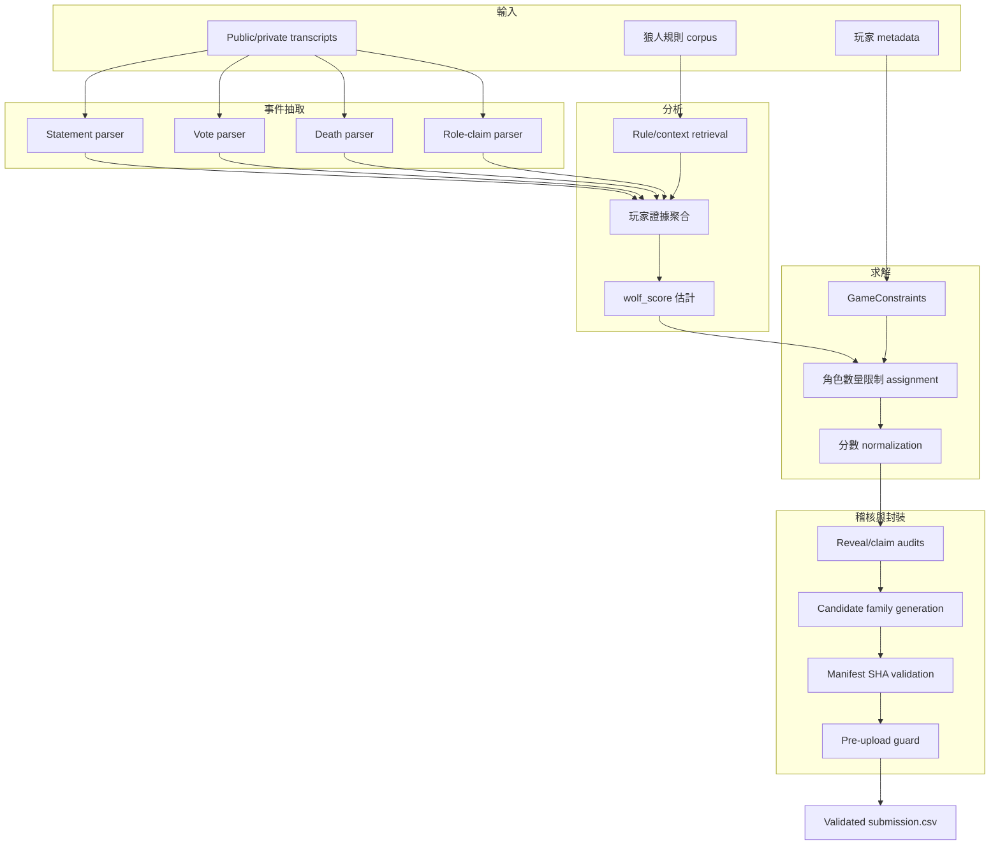
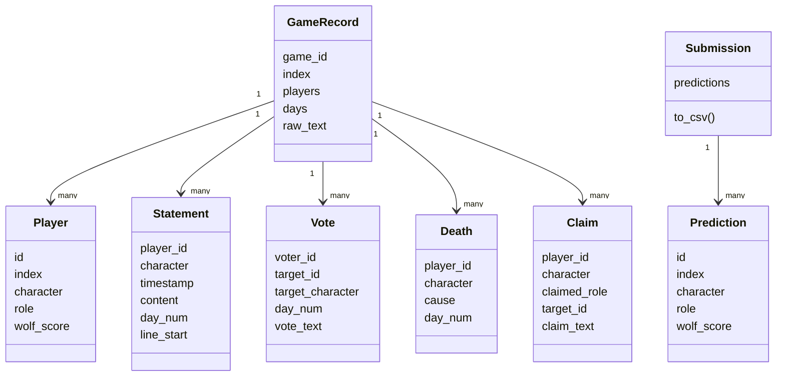
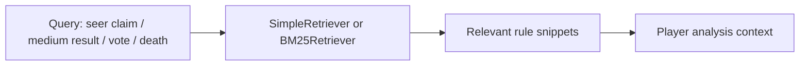
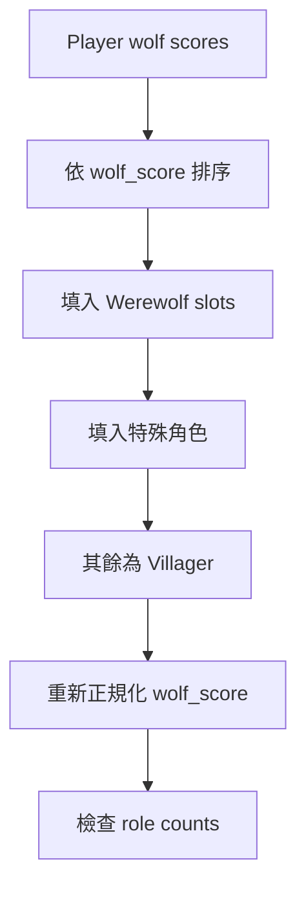
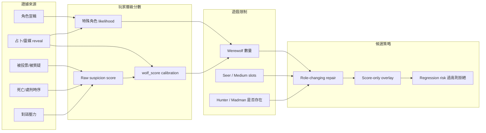
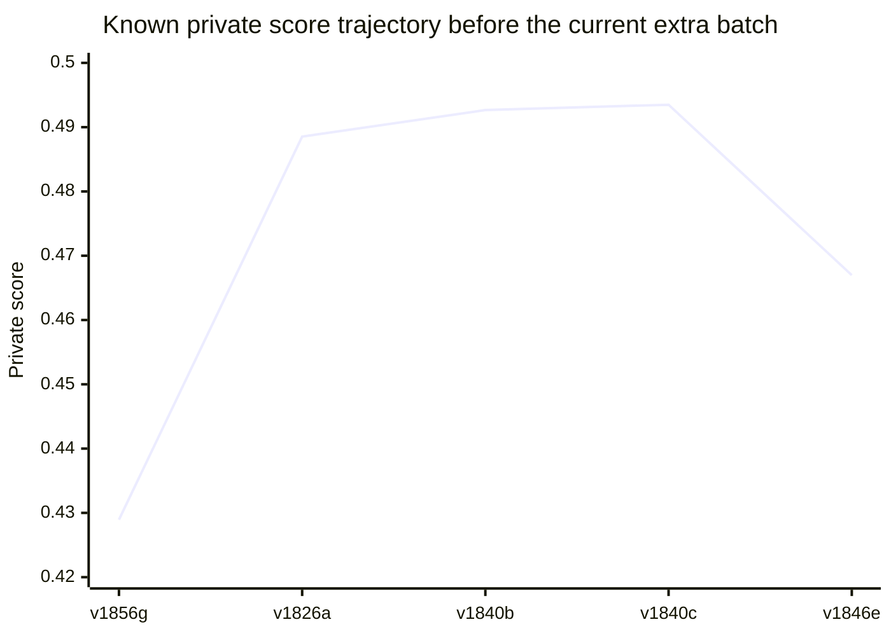
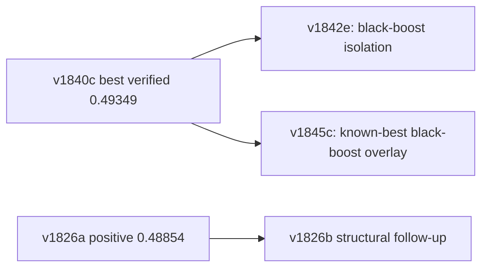
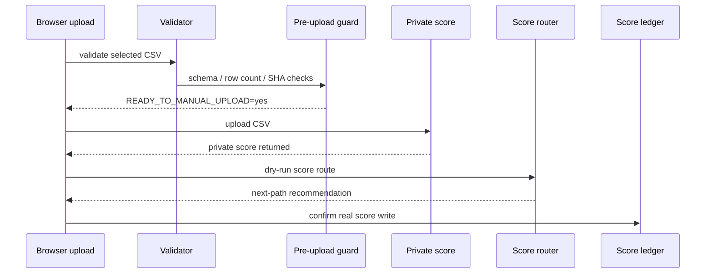

# 技術報告 — Werewolf RAG Multi-Agent Prediction System

日期：2026-05-15
Public branch：`main`
目前 upload candidate：`v1842e`
extra sprint 前最佳已驗證 private score：`v1840c = 0.49349`

## 1. 摘要

本專案針對狼人遊戲逐字稿預測玩家隱藏角色。系統採 local-first 設計，核心流程包含：逐字稿事件抽取、狼人規則檢索、玩家證據分析、角色數量限制求解、後期 deterministic audit，以及可追蹤的 submission package。

專案分成兩層：

| 層級 | 目的 | 主要路徑 |
| --- | --- | --- |
| 作業封裝層 | 乾淨的 HW2 程式碼、報告、checkpoint、validator | `hw2_D13922024/` |
| 實驗與操作層 | candidate archive、manifest、score ledger、preflight、三連發候選 | `experiments/final_submission_package/` |

## 2. 任務定義

每位玩家需輸出一列：

```text
id,index,character,role,wolf_score
```

| 欄位 | 意義 | 限制 |
| --- | --- | --- |
| `id` | 玩家 row id | integer |
| `index` | game id | 如 `01` |
| `character` | 玩家名稱 | 必須保留資料集拼字 |
| `role` | 預測隱藏角色 | `Villager`, `Werewolf`, `Seer`, `Medium`, `Madman`, `Hunter` |
| `wolf_score` | Werewolf 傾向分數 | `[0, 1]` float |

validator 會檢查 header、欄位數、角色名稱、score 範圍與 row count。

## 3. 系統總覽



## 4. 資料模型

資料 schema 位於 `hw2_D13922024/src/data/schema.py`。



## 5. 各階段技術細節

### 5.1 Stage 1：逐字稿事件抽取

實作：`hw2_D13922024/src/agents/stage1_fetching.py`

| Extractor | 抽取訊號 | 用途 |
| --- | --- | --- |
| Statement parser | speaker、timestamp、day、line number | 建立玩家發言量與證據窗口 |
| Vote parser | vote target / tally | 捕捉處刑壓力與社交懷疑流向 |
| Death parser | execution / night death | 錨定死亡事件與後續 reveal window |
| Claim parser | Seer / Medium / Hunter / Madman claim | 建立角色宣稱與矛盾檢查基礎 |

此階段刻意使用 deterministic parsing，優先確保可追蹤、可重現，而非不可解釋的黑箱判斷。

### 5.2 RAG 規則檢索

實作：`hw2_D13922024/src/rag/`

規則 corpus 包含角色行為、勝利條件、投票規則、術語與證據 pattern。Retriever 提供 simple keyword 與 BM25-like term overlap 兩種模式。



這讓角色判斷時能有明確可讀的規則上下文，同時避免外部 API 依賴。

### 5.3 Stage 2：玩家分析與 wolf_score

實作：`hw2_D13922024/src/agents/stage2_analysis.py`

| Feature | 對 wolf_score 方向 | 理由 |
| --- | --- | --- |
| 發言少 | 增加不確定/懷疑 | 沉默玩家較難被村民陣營排除 |
| 死亡/處刑資訊 | 影響上下文 | 死亡事件常與 medium/seer reveal 有關 |
| 被投票/被壓力 | 增加懷疑 | 多人投票壓力可能代表社交共識 |
| 角色宣稱 keyword | 改變 role candidate | Seer/Medium/Hunter/Madman claim 是高資訊訊號 |
| 防禦/指控 pattern | 增加狼側可能 | 捕捉常見 deception pattern |

### 5.4 Stage 3：角色限制求解器

實作：`hw2_D13922024/src/agents/stage3_solver.py`

| 玩家數 | Werewolves | Seer | Medium | Hunter | Madman |
| ---: | ---: | --- | --- | --- | --- |
| `<= 12` | `2` | yes | yes | no | no |
| `>= 13` | `3` | yes | yes | yes | yes |

流程：



final score policy：

| Assigned role | `wolf_score` policy |
| --- | --- |
| `Werewolf` | `1.0` |
| `Madman` | `0.0` |
| 非狼角色 | 以原始分數縮放並 cap 在 `0.5` |

### 5.5 Feature-to-decision calibration map

本專案不是單純把 `wolf_score` 排序後直接輸出，而是把角色預測視為「受角色數量限制的決策問題」。先把逐字稿證據整理成玩家層級訊號，再由角色 budget 與後期 audit 決定要改 `role`，或只微調 `wolf_score`。



決策粒度：

| Evidence strength | 允許動作 | Typical family | 理由 |
| --- | --- | --- | --- |
| hard contradiction 或 reveal repair | 改 `role` 並調整 `wolf_score` | structural queue | 角色標籤本身可能錯，score-only 不足 |
| black-result / explicit wolf evidence 且不衝突 role count | 只調整 `wolf_score` | black-boost queue | 保留角色配置，只移動排名敏感 rows |
| 只有 weak public-proxy lift | 產生候選但放在後順位 | denoise / prior queues | public lift 對 private feedback 的轉移不穩 |
| 沒有本地證據或 diff 重複 | upload 前拒絕 | guard / manifest stage | 保護有限 submit 次數 |

## 6. 後期 audit 與候選生成

後期實驗專注於 deterministic evidence repair 與 score calibration。

| Family | 目的 | Example candidates |
| --- | --- | --- |
| Structural queue | 根據 transcript evidence 修正角色 | `v1826a`, `v1826b`, `v1826d` |
| Overlay queue | 在 structural candidate 上做 score-only precision overlay | `v1838c`, `v1839c`, `v1840c` |
| Black-boost queue | 對 black-result / Werewolf evidence 做 targeted boost | `v1842e` |
| Role-cap / denoise / priors | public proxy calibration variants | `v1846e`, `v1850g`, `v1856g` |
| Extra fixed batch | 額外 submit 機會的三個固定候選 | `v1842e`, `v1845c`, `v1826b` |

## 7. Private score ledger

score ledger：

```text
experiments/final_submission_package/manifests/v1836_score_feedback_records.csv
```

| Attempt | Candidate | Private score | Decision |
| ---: | --- | ---: | --- |
| 1 | `v1856g` | `0.42894` | balanced-prior score-only transfer failed |
| 2 | `v1826a` | `0.48854` | strong positive structural signal |
| 3 | `v1840b` | `0.49266` | positive overlay signal |
| 4 | `v1840c` | `0.49349` | extra sprint 前最佳已驗證分數 |
| 5 | `v1846e` | `0.46698` | role-cap stack regression |

目前 `main` 的 `v1842e` 已通過本地驗證，但尚未有回傳 private score。

分數軌跡圖：



若閱讀器不支援 Mermaid chart，可用下表快速判讀：

| Candidate | Score | Relative bar | 解讀 |
| --- | ---: | --- | --- |
| `v1856g` | `0.42894` | `█████████████████░░░` | balanced-prior-only transfer 失敗，不應重複 |
| `v1826a` | `0.48854` | `███████████████████████████████████████░` | structural repair 對 private 有正向轉移 |
| `v1840b` | `0.49266` | `████████████████████████████████████████` | high-precision overlay 改善 baseline |
| `v1840c` | `0.49349` | `████████████████████████████████████████` | 目前最佳已驗證 rollback candidate |
| `v1846e` | `0.46698` | `█████████████████████████████████░░░░░░░` | role-cap stack regression |

最重要的 empirical lesson：小範圍、證據導向的 structural / overlay 改動，比大範圍 score-shape calibration 更安全。

## 8. 目前候選與三連發策略



| 順序 | Candidate | Diff vs `v1840c` | Role diff | Score diff | 理由 |
| ---: | --- | ---: | ---: | ---: | --- |
| 1 | `v1842e` | `3` | `0` | `3` | 隔離 black-boost，避開 role-cap regression |
| 2 | `v1845c` | `15` | `10` | `12` | 高波動 known-best black-boost overlay |
| 3 | `v1826b` | `16` | `4` | `16` | `v1826a=0.48854` 後的 structural follow-up |

三個 CSV 都已通過 validator：

| Candidate | Path | Validator |
| --- | --- | --- |
| `v1842e` | `upload_batch_2026-05-15_extra3/01_v1842e_conservative_blackboost_isolation_private.csv` | `OK: 397 predictions validated` |
| `v1845c` | `upload_batch_2026-05-15_extra3/02_v1845c_high_variance_knownbest_blackboost_private.csv` | `OK: 397 predictions validated` |
| `v1826b` | `upload_batch_2026-05-15_extra3/03_v1826b_structural_positive_followup_private.csv` | `OK: 397 predictions validated` |

候選選擇矩陣：

| Candidate | Evidence type | Expected upside | Variance | Reversibility | Upload priority |
| --- | --- | --- | --- | --- | --- |
| `v1842e` | score-only black-result isolation | medium | low | high，只動 `v1840c` 的 3 個 score rows | first |
| `v1845c` | known-best plus stronger black overlay | high | high | medium，role 與 score rows 都會動 | second |
| `v1826b` | structural follow-up to positive family | medium-high | medium | medium，4 個 role rows 變動 | third |

第一個候選刻意保守：只測試 narrow black-evidence signal 是否能提升 private ranking，不破壞目前最佳已驗證的角色結構。第二與第三候選則作為分數回饋支持更高波動時的 escalation path。

## 9. Submission operation safety gates



| Script | 用途 |
| --- | --- |
| `v1869_attempt_budget_guard.py` | 回報 attempts used / remaining |
| `v1904_attempt_state_guard.py` | 檢查 current upload 是否符合 score-feedback state |
| `v1883_pre_upload_guard.py` | 檢查 manifest、metadata、aliases、score-report state |
| `v1888_final_upload_preflight.py` | 一鍵 upload readiness check |
| `v1906_goal_completion_gate.py` | 防止提早宣告 score goal complete |
| `v1908_final_goal_status.py` | 彙整 upload / goal 狀態 |

## 10. 重現指令

快速重現：

```bash
cd hw2_D13922024
python3 make_final.py --output /tmp/werewolf_submission_check.csv
```

目前 upload 驗證：

```bash
python3 werewolf-project/assert/validate_submission.py \
  experiments/final_submission_package/current_upload/submission.csv
```

三連發候選驗證：

```bash
python3 werewolf-project/assert/validate_submission.py \
  experiments/final_submission_package/upload_batch_2026-05-15_extra3/01_v1842e_conservative_blackboost_isolation_private.csv
python3 werewolf-project/assert/validate_submission.py \
  experiments/final_submission_package/upload_batch_2026-05-15_extra3/02_v1845c_high_variance_knownbest_blackboost_private.csv
python3 werewolf-project/assert/validate_submission.py \
  experiments/final_submission_package/upload_batch_2026-05-15_extra3/03_v1826b_structural_positive_followup_private.csv
```

## 11. 風險矩陣

| 風險 | 嚴重度 | 緩解方式 |
| --- | --- | --- |
| public proxy calibration 不能轉移到 private leaderboard | high | 保留 score ledger、避免 duplicate upload、使用多樣 candidate family |
| 完整逐字稿重現依賴本機模型 | medium | 提供 fast checkpoint reproduction 與 validator evidence |
| `v1842e` 尚未有 private score | medium | 明確區分 local validation 與 private score completion |
| experiment archive 很大，新讀者可能迷路 | medium | root README、structure guide、technical report 提供固定入口 |

## 12. 結論

本專案在 packaged-submission 層可重現，在 experiment archive 層可稽核。extra sprint 前最佳已驗證 private score 是 `0.49349`；目前 `main` 準備了 `v1842e` 與三連發候選，並以 manifest hash、validator、preflight guard 與 score recording gate 保護提交流程。
