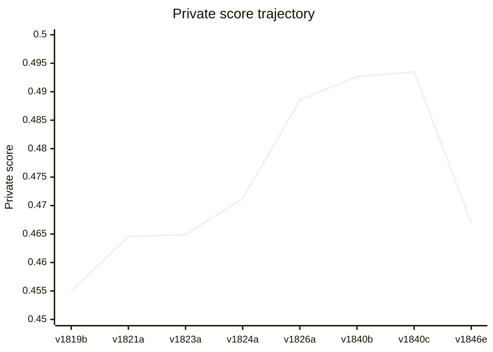
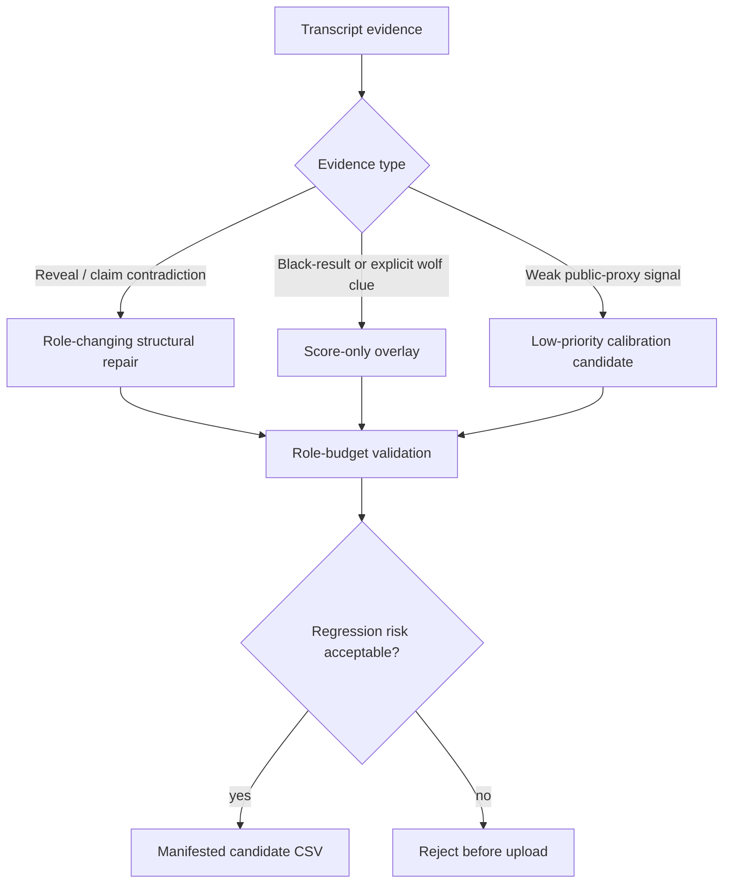

# HW2 Report: Multi-Agent Werewolf Prediction

**Student ID:** D13922024
**Current main upload candidate:** v1842e
**Best verified rollback score:** v1840c = 0.49349
**Current candidate status:** locally validated, private score pending
**Score formula:** 0.4 × Macro-F1 + 0.6 × Werewolf AP

## 1. Task and Constraints

The task is to predict each player's role and `wolf_score` from Werewolf game transcripts.  The private split contains 30 games and 397 players.  Valid roles are Villager, Werewolf, Seer, Medium, Hunter, and Madman.

The solution follows the course constraints:

- use at least two coordinated reasoning components;
- use retrieval-augmented transcript evidence;
- do not train or fine-tune a model;
- use local inference and deterministic post-processing only;
- validate every submission CSV before upload.

The public `main` package currently defaults to `v1842e`, which is locally validated for the reopened extra-submit sprint.  The best verified rollback checkpoint remains `v1840c = 0.49349`.  The failed role-cap experiment `v1846e = 0.46698` remains documented for traceability.

## 2. System Design

```text
Transcript files
    │
    ▼
Fetching component
    - parse player lists, claims, votes, executions, deaths, and reveal windows
    - retrieve role rules and player-specific evidence snippets
    │
    ▼
Analysis component + verifier
    - rank Werewolf, Seer, Medium, Hunter, Madman, and Villager candidates
    - check contradictions between claims, lynch results, and night events
    - emit structured row-level repair suggestions
    │
    ▼
Constrained solver
    - enforce role budgets by game size
    - merge deterministic reveals, claim-graph evidence, and local model audits
    - output `id,index,character,role,wolf_score`
    │
    ▼
Final queue and packaging
    - package validated CSV candidates with SHA-256 hashes
    - record private feedback and preserve rollback checkpoints
```

The design separates evidence retrieval from constrained decisions.  Retrieved facts are first listed as transcript evidence, then the verifier checks whether a proposed role assignment is compatible with role budgets, claims, and event timing.  The final solver is deterministic so that a selected candidate can be reproduced from the bundled checkpoints.

## 3. Retrieval-Augmented Evidence

The retrieval corpus contains role rules, game-size role budgets, common deception patterns, and transcript-derived windows around claims and executions.  Retrieval is used before high-impact repairs:

- **Role-rule retrieval:** confirms whether Seer, Medium, Hunter, or Madman can appear in the current game size.
- **Claim retrieval:** collects who claimed a role and who accused whom as black or white.
- **Post-lynch retrieval:** scans the window after an execution for structured Medium-style role reveals.
- **Cross-check retrieval:** compares local model suggestions against deterministic events and existing role budgets.

The strongest prompt pattern is evidence-first: list retrieved facts, identify contradictions, then request a constrained decision.  This reduces the chance that in-game deception is mistaken for ground truth.

## 4. Optimization Strategy

1. **Constrained role budgets.**  The solver enforces the number of Werewolves and special roles for each game size, preventing impossible submissions.
2. **Structural reveal filtering.**  The pipeline prioritizes bracketed or execution-anchored reveal patterns and rejects casual accusations when they are not tied to a game event.
3. **Claim-graph consistency.**  Repeated claim interactions are represented as a graph, which helps identify true-Seer, fake-Seer, and Medium contradictions.
4. **Local model audits with caching.**  Local model outputs are cached per game or row so experiments are reproducible and do not require external services.
5. **Leaderboard-safe queueing.**  Final attempts are ordered from strongest evidence to highest upside, with rollback checkpoints for known private scores.
6. **Validation-first packaging.**  Every final-pack CSV is copied with SHA-256 tracking and checked by the assignment validator.

## 5. Result Trajectory

| Candidate | Private score | Main idea | Outcome |
| --- | ---: | --- | --- |
| v1819b | 0.45499 | v1817b/v1818a positive stack | early improvement |
| v1821a | 0.46455 | claim-graph CSP plus g10 Pamela repair | positive |
| v1823a | 0.46492 | v1821a plus v1819b positive stack | positive |
| v1824a | 0.47119 | v1823a plus g24 Thomas true-Seer repair | previous rollback best |
| v1826a | 0.48854 | g4/g29 structural and AP boost push | major improvement |
| v1840b | 0.49266 | high-precision Medium/AP overlay | positive |
| v1840c | 0.49349 | v1840 overlay extended to v1829e clean Hail Mary family | best verified |
| v1846e | 0.46698 | final role-cap one-shot on top of v1842e | failed last attempt |



Original final-attempt budget used `5/5` attempts before the extra-submit sprint reopened.  The best verified rollback is `v1840c = 0.49349`; the current `main` upload candidate is `v1842e`, chosen to isolate the black-boost signal without the failed role-cap stack.  The original top-three gate `>0.52380` has not been reached yet.

## 6. Success and Failure Analysis

**What worked.**  The largest gains came from auditable structural repairs: claim-graph contradictions, true-Seer/Medium consistency checks, and carefully scoped AP overlays.  The move from `0.47119` to `0.48854` and then to `0.49349` shows that small evidence-backed changes transferred better than broad rewrites.

**What failed.**  The final role-cap attempt was selected because public proxy and leave-one-out checks were strong, but private feedback regressed sharply.  This confirms that public AP calibration was not a reliable substitute for transcript-grounded evidence on the private split.

**Mitigation used in the public package.**  The package keeps `v1840c` as the best verified rollback checkpoint while exposing `v1842e` as the current extra-sprint upload candidate.  The failed `v1846e` file remains in checkpoints and the experiment ledger for traceability.

## 7. Reproducibility

From the package directory:

```bash
python3 make_final.py --output submission.csv
```

The command copies the current main candidate and runs the validator.  Expected validator output:

```text
OK: 397 predictions validated
```

Additional validation:

```bash
python3 assert/validate_submission.py submission.csv
```

The expected private submission shape is 397 predictions with header:

```text
id,index,character,role,wolf_score
```

The complete final-attempt archive and score-feedback ledger are preserved under:

```text
experiments/final_submission_package/
experiments/final_submission_package/manifests/v1836_score_feedback_records.csv
```


## 8. Extended Technical Appendix

The public branch contains a fuller technical report with additional diagrams and tables:

```text
docs/TECHNICAL_REPORT.md
docs/TECHNICAL_REPORT.zh-TW.md
```

### 8.1 Pipeline diagram


### 8.2 Core artifacts

| Artifact | Path | Purpose |
| --- | --- | --- |
| Current upload CSV | `experiments/final_submission_package/current_upload/submission.csv` | Main branch upload candidate |
| Three-candidate batch | `experiments/final_submission_package/upload_batch_2026-05-15_extra3/` | Fixed manual upload paths |
| Score ledger | `experiments/final_submission_package/manifests/v1836_score_feedback_records.csv` | Private feedback history |
| Preflight report | `experiments/reports/v1888_final_upload_preflight.md` | Upload-readiness evidence |
| Goal gate | `experiments/reports/v1906_goal_completion_gate.md` | Prevents premature completion claims |

### 8.3 Extra sprint candidate matrix

| Order | Candidate | Diff vs `v1840c` | Role diff | Score diff | Why it is in the batch |
| ---: | --- | ---: | ---: | ---: | --- |
| 1 | `v1842e` | 3 | 0 | 3 | conservative black-boost isolation |
| 2 | `v1845c` | 15 | 10 | 12 | higher-variance known-best overlay |
| 3 | `v1826b` | 16 | 4 | 16 | structural follow-up after positive `v1826a` |

### 8.4 Decision map



### 8.5 Reproduction and validation commands

```bash
python3 werewolf-project/assert/validate_submission.py \
  experiments/final_submission_package/current_upload/submission.csv
cd hw2_D13922024
python3 make_final.py --output /tmp/werewolf_submission_check.csv
```

Expected validator output remains:

```text
OK: 397 predictions validated
```
