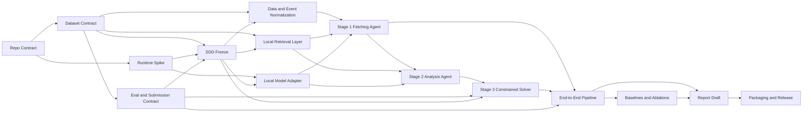

# Task Plan: Multi-Agent Werewolf Prediction

## Goal
Build a multi-agent Langchain system to predict player roles and wolf scores in Werewolf game records, achieving competitive performance on Kaggle (Macro-F1 + AP) with detailed report.

## 作業需求對照檢查

### 技術要求
- [ ] Multi-agent system with **at least 2 agents** (Langchain)
- [ ] Models: Qwen2.5-7B-Instruct-GGUF / GLM-4-32B-0414 / Gemma 4 E2B (≤12GB VRAM)
- [ ] **NO training/fine-tuning**
- [ ] **NO external APIs**
- [ ] Use RAG for data retrieval

### 數據需求
- [ ] Dataset_README.md (need to obtain from Kaggle/NTU COOL)
- [ ] Werewolf_Corpus (50 game runs - 20 public, 30 private)
- [ ] roles.csv, roles_with_gt.csv

### 提交格式
- [ ] `hw2_<student-id>.zip`
  - [ ] `hw2_<student-id>.pdf` (Report within 5 pages)
  - [ ] `main.py` (Main Python script)
  - [ ] `assert/` (Other Python scripts)
  - [ ] `requirements.txt`
  - [ ] `README`

### 評分
- [ ] 80% Performance Ranking (Kaggle private leaderboard)
  - [ ] Beat simple baseline
  - [ ] Beat strong baseline
- [ ] 20% Report
  - [ ] Design Structure / Prompt Design Diagram (5%)
  - [ ] Discussion of Success and Failure Cases (5%)
  - [ ] Optimizations and Improvements Made (10%)

## Phases

### Phase 1: 項目初始化與環境建置
- [ ] 1.1 Create project directory structure
- [ ] 1.2 Initialize uv project with Python
- [ ] 1.3 Set up git repository with dev flow
- [ ] 1.4 Create requirements.txt with dependencies
- [ ] 1.5 Verify environment setup

### Phase 2: 數據獲取與分析
- [ ] 2.1 Obtain dataset (Kaggle/NTU COOL)
- [ ] 2.2 Read and understand Dataset_README.md
- [ ] 2.3 Analyze Werewolf_Corpus structure
- [ ] 2.4 Analyze roles.csv format
- [ ] 2.5 Document data schema and game rules

### Phase 3: 系統架構設計 (SDD)
- [ ] 3.1 Design multi-agent architecture
  - [ ] Data Fetching Agent (Stage 1)
  - [ ] Event Analysis Agent (Stage 2)
  - [ ] Constrained Solver Agent (Stage 3)
- [ ] 3.2 Design RAG pipeline
- [ ] 3.3 Design prompt templates
- [ ] 3.4 Document architecture in SPEC.md

### Phase 4: 實現 - 數據處理層
- [ ] 4.1 Implement data loader
- [ ] 4.2 Implement RAG retrieval
- [ ] 4.3 Write unit tests for data layer

### Phase 5: 實現 - Agent層
- [ ] 5.1 Implement Data Fetching Agent
- [ ] 5.2 Implement Event Analysis Agent
- [ ] 5.3 Implement Constrained Solver Agent
- [ ] 5.4 Write integration tests for agents

### Phase 6: 實現 - 主程序與預測
- [ ] 6.1 Implement main.py prediction pipeline
- [ ] 6.2 Implement output format for Kaggle
- [ ] 6.3 Write function tests

### Phase 7: TDD - 測試驅動開發
- [ ] 7.1 Unit tests: data processing
- [ ] 7.2 Unit tests: agent logic
- [ ] 7.3 Integration tests: full pipeline
- [ ] 7.4 Ensure all tests pass

### Phase 8: 優化與調參
- [ ] 8.1 Optimize RAG retrieval accuracy
- [ ] 8.2 Tune prompt templates
- [ ] 8.3 Optimize agent coordination
- [ ] 8.4 Validate against baselines

### Phase 9: 報告撰寫
- [ ] 9.1 Write Design Structure / Prompt Design Diagram
- [ ] 9.2 Document Success and Failure Cases
- [ ] 9.3 Describe Optimizations and Improvements
- [ ] 9.4 Format to within 5 pages

### Phase 10: 提交準備
- [ ] 10.1 Create final project structure
- [ ] 10.2 Generate hw2_<student-id>.zip
- [ ] 10.3 Verify all requirements met

## Key Questions
1. Where to obtain the dataset files? (Kaggle competition link?)
2. What is the exact output format for Kaggle submission?
3. What is student's NTU student ID for submission naming?

## Decisions Made
- Using uv for Python package management
- Following git dev flow: main → develop → feature branches
- TDD approach with pytest

## Errors Encounter
- [ ] Dataset files not found - need to obtain from Kaggle/NTU COOL

## Status
**Currently in Phase 1** - Initializing project structure and Git Flow

## 數據集分析

### 數據結構
- `Dataset_README.md`: 遊戲規則說明
- `public/` (20場) + `private/` (30場)
- `roles.csv`: 預測格式 (id,index,character,role,wolf_score)
- `roles_with_gt.csv`: 公開遊戲的ground truth

### 角色種類
| Role | wolf_score | 特殊能力 |
|------|-----------|---------|
| Villager | 0.0 | 無 |
| Werewolf | 1.0 | 夜晚殺人 |
| Seer | 0.0 | 夜晚占卜 |
| Medium | 0.0 | 驗屍 |
| Madman | 0.0 | 狼人陣營 |
| Hunter | 0.0 | 守衛 |

### 遊戲規則
- ≤12 players: 2 werewolves
- ≥13 players: 3 werewolves
- Madman, Hunter: ≥11 players

### 預測任務
- 預測每個玩家的 role
- 預測每個玩家的 wolf_score (0.0 或 1.0)

## Session IDs for Continuation
- Librarian research session: ses_22b2caec9ffe5UmNUEJ6hTOmFd
- Werewolf AI research session: ses_22b2ca552ffedCrBL1HvfsoLjm
- Plan agent session: ses_22b2a237affeOs2Btg5vPODmTY

## 詳細工作計劃 (from Plan Agent)

### Parallel Task Graph

### Structured TODO List
| ID | Task | Category | Skills | Depends |
|---|---|---|---|---|
| T0 | Freeze branch/worktree/dev-flow policy | writing | planning-with-files, git-master | - |
| T1 | Acquire dataset and sample submission | deep | planning-with-files | T0 |
| T2 | Run local runtime compatibility spike | unspecified-high | git-master, verification | T0 |
| T3 | Build metric and submission contract | deep | test-driven-development | T1 |
| T4 | Write SDD and interface contracts | writing | planning-with-files, writing-plans | T1,T2,T3 |
| T5 | Implement transcript loader and schema | unspecified-high | test-driven-development | T1,T4 |
| T6 | Implement local retrieval layer | deep | test-driven-development | T1,T4 |
| T7 | Implement local GGUF model adapter | unspecified-high | test-driven-development | T2,T4 |
| T8 | Implement Stage 1 Fetching Agent | deep | test-driven-development | T5,T6,T7 |
| T9 | Implement Stage 2 Analysis Agent | ultrabrain | test-driven-development | T6,T7,T8 |
| T10 | Implement Stage 3 Constrained Solver | ultrabrain | test-driven-development | T3,T4,T9 |
| T11 | Wire end-to-end pipeline and CLI | unspecified-high | test-driven-development, verification | T3,T8,T10 |
| T12 | Run baselines and public-slice eval | deep | verification, code-review | T11 |
| T13 | Draft report and diagrams | writing | planning-with-files | T4,T12 |
| T14 | Package final deliverable | quick | git-master, verification, finishing | T13 |

### Suggested Timebox
| Window | Target |
|---|---|
| Apr 29 - Apr 30 | T0-T4 |
| May 1 - May 4 | T5-T8 |
| May 5 - May 8 | T9-T11 |
| May 9 - May 11 | T12 |
| May 12 - May 14 | T13-T14 |
| May 15 | buffer, final checks, submission |

## 需確認問題

### 緊急：需要數據集
目前項目中**沒有數據集文件**（Dataset_README.md, Werewolf_Corpus, roles.csv）。請問：
1. 數據集從何處取得？（Kaggle 連結？）
2. 樣本提交格式為何？

### 其他確認
1. 硬體規格：GPU 型號、VRAM、CPU cores、RAM？
2. Git Flow 偏好：嚴格 main→develop→feature 或 輕量 feature/* off main？

## 已確認架構
- LangGraph for orchestration (非 free-form chat)
- llama-cpp-python for GGUF inference
- 2 LLM agents + 1 deterministic solver
- Primary model: Qwen2.5-7B-Instruct-GGUF
- Local-only retrieval (BM25/Chroma)
